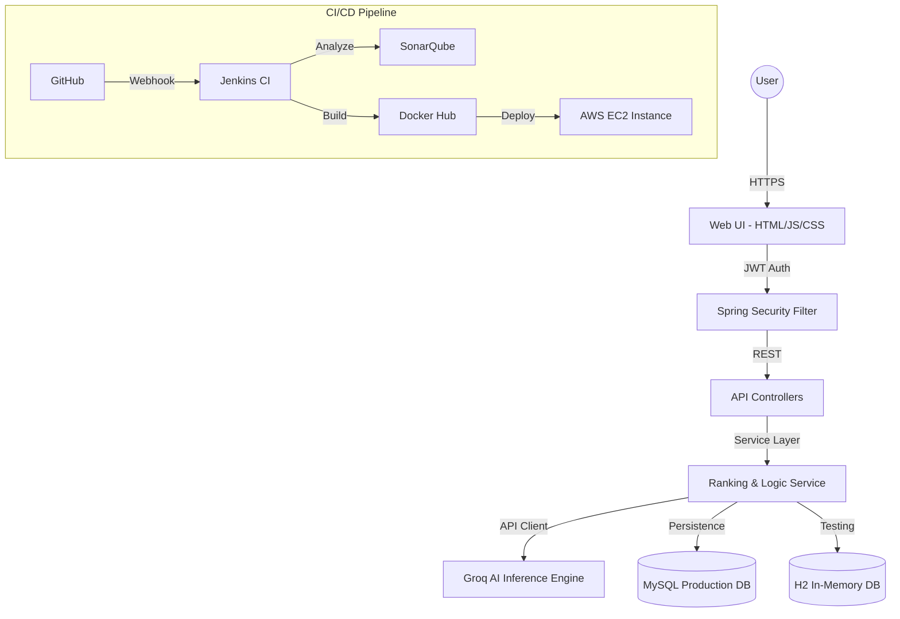

# ☁️ CloudCompare AI: Enterprise Multi-Cloud Intelligence Platform

[](https://openjdk.org)
[](https://spring.io/projects/spring-boot)
[](https://www.docker.com/)
[](https://jenkins.io)
[](https://sonarqube.org)
[](LICENSE)

**CloudCompare AI** is a production-grade, AI-driven decision engine designed to optimize cloud infrastructure selection across major hyperscalers (AWS, GCP, Azure, OCI, and Alibaba Cloud). Leveraging the high-speed **Groq LLM inference engine**, it provides real-time cost-benefit analysis, performance benchmarking, and architectural recommendations.

---

## 🚀 Key Capabilities

*   **🤖 AI-Powered Synthesis**: Utilizes Llama 3.1 via Groq API for sub-second analysis of complex cloud service specifications.
*   **⚖️ Multi-Cloud Benchmarking**: Real-time comparison of Compute, Storage, Database, and AI services across 5+ providers.
*   **🔐 Industrial Security**: Hardened JWT-based authentication with Spring Security and secure credential management.
*   **📊 Dynamic Visualization**: Interactive, data-driven dashboards using Chart.js for visual cost and performance analysis.
*   **🏗️ DevOps Excellence**: Fully automated CI/CD pipeline with Jenkins, SonarQube quality gates, and Dockerized deployment.

---

## 🏗️ Architectural Blueprint

The platform follows a clean, hexagonal-inspired architecture ensuring high maintainability and scalability.


### System Workflow


---

## 🛠️ Technical Ecosystem

| Layer | Technology | Purpose |
| :--- | :--- | :--- |
| **Backend** | Java 17, Spring Boot 3.2.5 | Core business logic & API |
| **Security** | Spring Security 6, JJWT | Identity & Access Management |
| **Data Layer** | Spring Data JPA, Hibernate | Persistence & ORM |
| **Database** | MySQL 8.3 (Prod), H2 (Dev) | Relational storage |
| **AI Engine** | Groq API (Llama 3.1) | Real-time service analysis |
| **DevOps** | Jenkins, Docker, SonarQube | CI/CD & Code Quality |
| **Testing** | JUnit 5, Mockito, JaCoCo | Verification & Coverage |

---

## 🚦 Getting Started

### Prerequisites
- **JDK 17+** (LTS)
- **Docker & Docker Compose**
- **Groq API Key** (Obtain from [Groq Console](https://console.groq.com))

### Configuration
Create a `.env` file in the root directory:
```env
GROK_API_KEYS=your_groq_api_key
DB_PASSWORD=your_secure_password
DB_URL=jdbc:mysql://localhost:3306/cloud_compare_ai
```

### Installation
```bash
# 1. Clone the repository
git clone https://github.com/raghavendra2006/CLOUD-COMPARE-AI.git

# 2. Build the application
./mvnw clean package -DskipTests

# 3. Run locally
./mvnw spring-boot:run
```

---

## 🐳 Containerization & Deployment

### Docker Compose
Deploy the entire stack (App + MySQL) with a single command:
```bash
docker-compose up -d --build
```

### Production CI/CD
The `Jenkinsfile` provides a declarative pipeline including:
1. **Build**: Compiles code and executes unit tests.
2. **Analysis**: Runs SonarQube static analysis.
3. **Quality Gate**: Blocks deployment if coverage or security rules fail.
4. **Publish**: Pushes Docker images to the registry.
5. **Deploy**: Triggers updates on the target EC2 environment.

---

## 🔌 API Governance

| Method | Endpoint | Description | Auth |
| :--- | :--- | :--- | :--- |
| `POST` | `/api/auth/signup` | Register a new enterprise user | None |
| `POST` | `/api/auth/login` | Authenticate and receive JWT | None |
| `GET` | `/api/test` | Service health & connectivity check | None |
| `POST` | `/api/compare` | AI-driven cloud service comparison | JWT |
| `POST` | `/api/ai-compare` | Purpose-driven AI tool analysis | JWT |
| `GET` | `/api/regions` | Retrieve supported cloud regions | JWT |

---

## 📂 Project Topology

```text
.
├── .mvn/                # Maven Wrapper configuration
├── src/
│   ├── main/
│   │   ├── java/.../ai/
│   │   │   ├── config/      # Security & Bean configurations
│   │   │   ├── controller/  # REST Endpoints
│   │   │   ├── dto/         # Data Transfer Objects
│   │   │   ├── entity/      # JPA Entities
│   │   │   ├── security/    # JWT & Auth Logic
│   │   │   └── service/     # Business Logic
│   │   └── resources/
│   │       ├── static/      # Frontend Web Assets
│   │       └── application.properties
│   └── test/                # JUnit 5 & Integration Tests
├── Dockerfile           # Multi-stage Docker build
├── docker-compose.yml   # Multi-container orchestration
├── Jenkinsfile          # Pipeline-as-code
└── pom.xml              # Maven dependencies
```

---

## 🧪 Engineering Excellence

We maintain a high standard of code quality through:
- **Unit Testing**: 100% logic coverage with JUnit 5 and Mockito.
- **Integration Testing**: End-to-end verification using `@SpringBootTest`.
- **Static Analysis**: Integrated SonarQube scans for vulnerabilities and code smells.
- **Performance**: Groq API optimization for sub-second AI inference.

```bash
# Execute full test suite with coverage report
./mvnw test jacoco:report
```

---

## 🤝 Contributing & Standards

1.  **Commitment**: All code must pass the SonarQube quality gate.
2.  **Workflow**: Branch-based development (`feature/*`, `fix/*`).
3.  **Process**: Fork → Branch → Commit → PR → Review.

---

## 📄 License

Distributed under the **MIT License**. See `LICENSE` for more information.

---

**Developed with ❤️ by the CloudCompare AI Team**
*Empowering enterprises to navigate the cloud with AI precision.*
