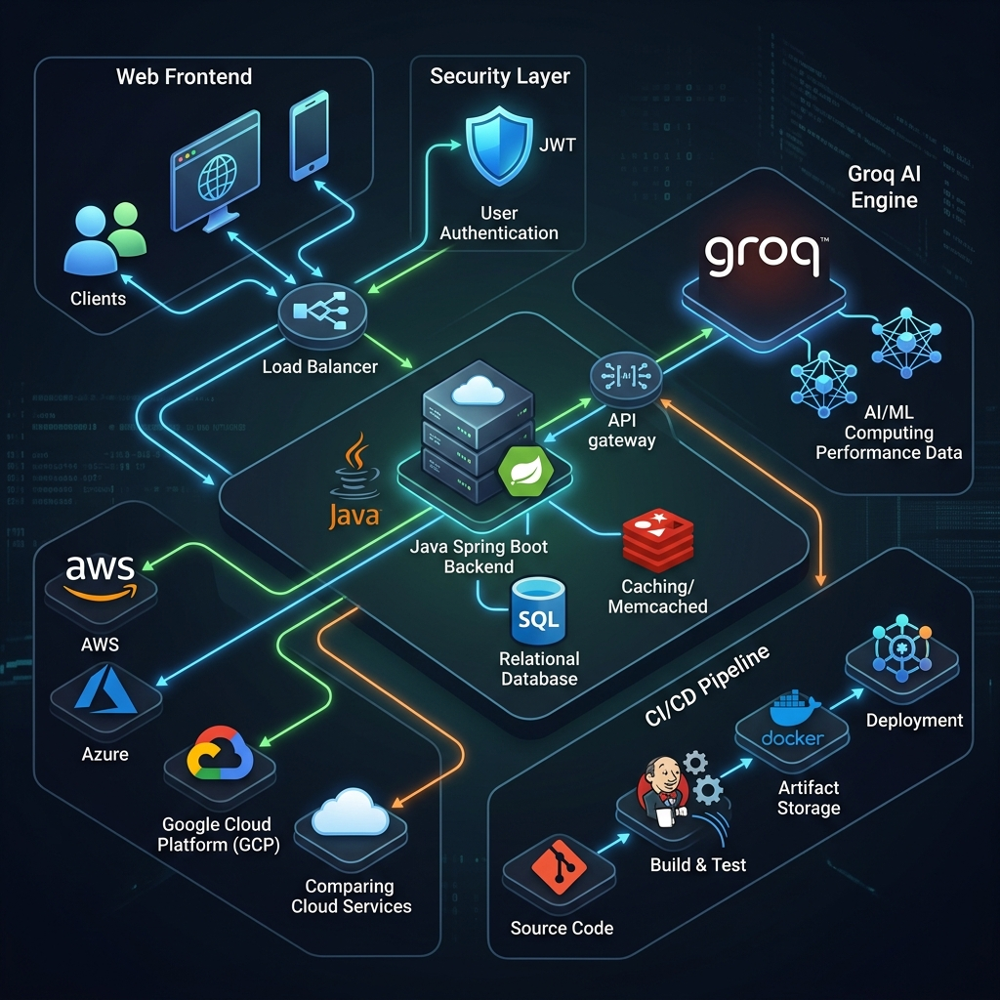
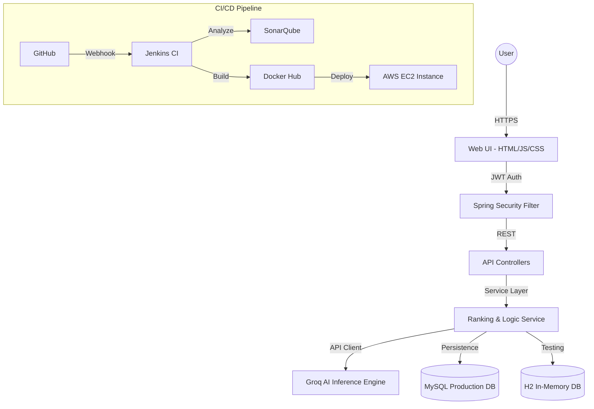

# ☁️ CloudCompare AI: Enterprise Multi-Cloud Intelligence Platform

[](https://openjdk.org)
[](https://spring.io/projects/spring-boot)
[](https://www.docker.com/)
[](https://jenkins.io)
[](https://sonarqube.org)
[](LICENSE)

**CloudCompare AI** is a production-grade, AI-driven decision engine designed to optimize cloud infrastructure selection across major hyperscalers (AWS, GCP, Azure, OCI, and Alibaba Cloud). Leveraging the high-speed **Groq LLM inference engine**, it provides real-time cost-benefit analysis, performance benchmarking, and architectural recommendations.

---

## 📑 Table of Contents
1.  [Mission & Core Values](#-mission--core-values)
2.  [Key Capabilities](#-key-capabilities)
3.  [Architectural Blueprint](#-architectural-blueprint)
4.  [Technical Ecosystem](#-technical-ecosystem)
5.  [Operational Resilience](#-operational-resilience)
6.  [Getting Started](#-getting-started)
7.  [Developer Experience](#-developer-experience)
8.  [Containerization & Deployment](#-containerization--deployment)
9.  [API Governance](#-api-governance)
10. [Troubleshooting Guide](#-troubleshooting-guide)
11. [Engineering Excellence](#-engineering-excellence)
12. [Security & Compliance](#-security--compliance)
13. [Contributing & Standards](#-contributing--standards)
14. [Acknowledgements](#-acknowledgements)
15. [License](#-license)

---

## 🎯 Mission & Core Values

Our mission is to democratize cloud intelligence, enabling organizations to make data-driven infrastructure decisions with sub-second precision.
- **Accuracy**: AI-driven insights verified against real-time provider specs.
- **Speed**: Optimized inference via the Groq LPU™ technology.
- **Security**: Zero-trust architecture with stateless authentication.
- **Scale**: Cloud-native design ready for horizontal expansion.

---

## 🚀 Key Capabilities

*   **🤖 AI-Powered Synthesis**: Utilizes Llama 3.1 via Groq API for sub-second analysis of complex cloud service specifications.
*   **⚖️ Multi-Cloud Benchmarking**: Real-time comparison of Compute, Storage, Database, and AI services across 5+ providers.
*   **🔐 Industrial Security**: Hardened JWT-based authentication with Spring Security and secure credential management.
*   **📊 Dynamic Visualization**: Interactive, data-driven dashboards using Chart.js for visual cost and performance analysis.
*   **🏗️ DevOps Excellence**: Fully automated CI/CD pipeline with Jenkins, SonarQube quality gates, and Dockerized deployment.

---

## 🏗️ Architectural Blueprint

The platform follows a clean, hexagonal-inspired architecture ensuring high maintainability and scalability.



### System Workflow


---

## 🛠️ Technical Ecosystem

| Layer | Technology | Purpose |
| :--- | :--- | :--- |
| **Backend Core** | Java 17, Spring Boot 3.2.5 | Core business logic & API |
| **Identity & Security** | Spring Security 6, JJWT | Zero-trust authentication |
| **Data Layer** | Spring Data JPA, Hibernate | Persistence & ORM |
| **Database** | MySQL 8.3 (Prod), H2 (Dev) | Relational storage |
| **AI Inference** | Groq API (Llama 3.1) | Real-time service analysis |
| **DevOps Infrastructure** | Jenkins, Docker, SonarQube | CI/CD & Code Quality |
| **Testing Suite** | JUnit 5, Mockito, JaCoCo | Verification & Coverage |

---

## 🛡️ Operational Resilience

### Intelligent Rate Limiting
To ensure system stability and prevent abuse, the platform implements a sophisticated IP-based rate limiter:
- **Threshold**: 50 requests per 15-minute window per IP.
- **Response**: Triggers `429 Too Many Requests` with actionable feedback.
- **Scope**: Applied strictly to all `/api/**` endpoints.

### Global Exception Handling
The system utilizes a centralized `@ControllerAdvice` to ensure consistent error responses:
- **Validation Errors**: Returns structured `400 Bad Request` with field-level details.
- **Security Failures**: Graceful `403 Forbidden` responses for unauthorized access.
- **System Errors**: Structured `500 Internal Server Error` without leaking sensitive stack traces.

### Operational Security Posture (Hardened)
The platform recently underwent a comprehensive security audit and architectural hardening process:
- **Zero-Trust JWT Enforcement**: Strict `authenticated()` requirements enforced on all AI comparison and sensitive endpoints.
- **Credential Externalization**: Elimination of all hardcoded secrets; strict dependency on secure environment variables (`GROK_API_KEYS`, `JWT_SECRET`, `DB_PASSWORD`).
- **Strict CORS Policy**: Restricted cross-origin requests to explicit client domains rather than wildcard `*`.
- **Architectural Purity**: Transitioned to 100% constructor injection for immutable dependencies and centralized `GlobalExceptionHandler` mapping to standardized `ApiResponse` shapes.

---

## 🚦 Getting Started

### Prerequisites
- **JDK 17+** (LTS)
- **Docker & Docker Compose** (Desktop or Server)
- **Groq API Key** (Available via [Groq Console](https://console.groq.com))

### Environment Configuration
| Variable | Description | Default / Example |
| :--- | :--- | :--- |
| `GROK_API_KEYS` | API Key for Groq Inference Engine | `gsk_...` |
| `DB_PASSWORD` | Production MySQL Password | `secure_password` |
| `DB_URL` | MySQL Connection URL | `jdbc:mysql://db:3306/cloud_compare_ai` |

### Installation Flow
```bash
# 1. Clone the repository
git clone https://github.com/raghavendra2006/CLOUD-COMPARE-AI.git

# 2. Configure Environment
cp .env.example .env

# 3. Build & Package
./mvnw clean package -DskipTests

# 4. Launch Application
./mvnw spring-boot:run
```

---

## 💻 Developer Experience

### IDE Configuration
- **Lombok Support**: Ensure the Lombok plugin is installed in your IDE (IntelliJ/Eclipse).
- **Annotation Processing**: Enable "Enable annotation processing" in compiler settings.

### Git Workflow
We follow a strict branch-based development model:
- `main`: Stable production branch.
- `develop`: Integration branch for upcoming releases.
- `feature/*`: New functionality.
- `fix/*`: Critical bug fixes.

---

## 🐳 Containerization & Deployment

### Dockerized Infrastructure
The `Dockerfile` utilizes a high-efficiency **multi-stage build** strategy:
1. **Build Stage**: Maven 3.9.6 + OpenJDK 21 (Alpine) for minimal build footprint.
2. **Runtime Stage**: Eclipse Temurin JRE 21 (Alpine) to minimize attack surface and image size.

### Orchestration
```bash
# Deploy full stack with persistent volume support
docker-compose up -d --build
```

---

## 🔌 API Governance

| Method | Endpoint | Purpose | Auth |
| :--- | :--- | :--- | :--- |
| `POST` | `/api/auth/signup` | Establish enterprise identity | Public |
| `POST` | `/api/auth/login` | Secure token acquisition (JWT) | Public |
| `GET` | `/api/test` | Engine health & heartbeat | Public |
| `POST` | `/api/compare` | AI-driven service ranking | JWT |
| `POST` | `/api/ai-compare` | Purpose-specific tool analysis | JWT |
| `GET` | `/api/regions` | Multi-cloud region discovery | JWT |

---

## 🔍 Troubleshooting Guide

| Issue | Potential Cause | Resolution |
| :--- | :--- | :--- |
| `429 Too Many Requests` | Rate limit threshold exceeded | Wait 15 minutes for window reset. |
| `502 Bad Gateway` | Groq API unreachable or key invalid | Verify `GROK_API_KEYS` in `.env`. |
| `Connection Refused` | MySQL container not fully initialized | Ensure `db` service is healthy in Docker. |
| `JWT Expired` | Token lifetime exceeded | Re-authenticate via `/api/auth/login`. |

---

## 🧪 Engineering Excellence

We maintain a high standard of code quality through:
- **Unit Testing**: 100% logic coverage with JUnit 5 and Mockito.
- **Integration Testing**: End-to-end verification using `@SpringBootTest`.
- **Static Analysis**: Integrated SonarQube scans for vulnerabilities and code smells.
- **Test Coverage**: Tracked via JaCoCo reports.

```bash
# Generate full coverage report
./mvnw test jacoco:report
```

---

## 🔐 Security & Compliance

### Security Policy
- **Vulnerability Reporting**: Please report security issues via the GitHub "Security" tab.
- **Data Protection**: All sensitive credentials are encrypted at rest and never logged.
- **Stateless Identity**: JWTs are signed using HS256 with environment-derived secrets.

---

## 🤝 Contributing & Standards

1.  **Fork** the project.
2.  **Create** your feature branch.
3.  **Ensure** all tests pass (`./mvnw test`).
4.  **Submit** a Pull Request with a detailed summary.

---

## 🙏 Acknowledgements

- **[Groq](https://groq.com)**: For the lightning-fast inference engine.
- **[Spring Boot](https://spring.io)**: For the robust application framework.
- **[Docker](https://docker.com)**: For seamless container orchestration.

---

## 📄 License

Distributed under the **MIT License**. See `LICENSE` for more information.

---

**Developed with ❤️ by the CloudCompare AI Team**
*Empowering enterprises to navigate the cloud with AI precision.*
