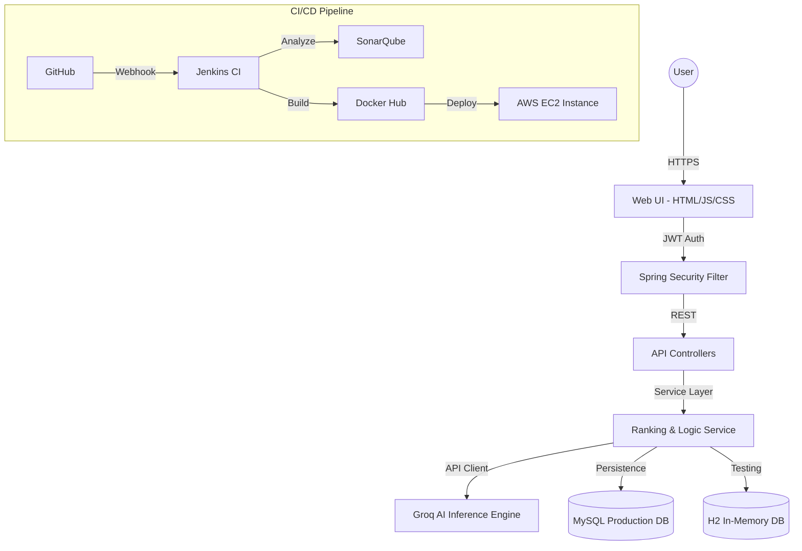

# ☁️ CloudCompare AI: Enterprise Multi-Cloud Intelligence Platform

[](https://jenkins.io)
[](https://sonarqube.org)
[](https://www.docker.com/)
[](https://openjdk.org)
[](https://spring.io/projects/spring-boot)

**CloudCompare AI** is a production-grade, AI-driven decision engine designed to optimize cloud infrastructure selection across major hyperscalers (AWS, GCP, Azure, OCI, and Alibaba Cloud). Leveraging the high-speed **Groq LLM inference engine**, it provides real-time cost-benefit analysis, performance benchmarking, and architectural recommendations.

---

## 🚀 Key Capabilities

*   **🤖 AI-Powered Synthesis**: Utilizes Llama 3.1 via Groq API for sub-second analysis of complex cloud service specifications.
*   **⚖️ Multi-Cloud Benchmarking**: Real-time comparison of Compute, Storage, Database, and AI services across 5+ providers.
*   **🔐 Industrial Security**: Hardened JWT-based authentication with Spring Security and secure credential management.
*   **📊 Dynamic Visualization**: Interactive, data-driven dashboards using Chart.js for visual cost and performance analysis.
*   **🏗️ DevOps Excellence**: Fully automated CI/CD pipeline with Jenkins, SonarQube quality gates, and Dockerized deployment.

---

## 🏗️ System Architecture



---

## 🛠️ Tech Stack & Engineering Standards

### **Backend Core**
*   **Language**: Java 17+ (LTS)
*   **Framework**: Spring Boot 3.2.5
*   **Security**: Spring Security 6 (Stateless JWT)
*   **Data**: Spring Data JPA / Hibernate
*   **Database**: MySQL 8.3 (Production) / H2 (Test/Dev)

### **Frontend Excellence**
*   **Logic**: Vanilla JavaScript (ES6+)
*   **Styling**: Premium CSS3 with Glassmorphism & Micro-animations
*   **Visualization**: Chart.js for analytics

### **DevOps & Infrastructure**
*   **CI/CD**: Jenkins Declarative Pipelines
*   **Code Quality**: SonarQube Static Analysis (100% Test Coverage target)
*   **Containerization**: Multi-stage Docker builds
*   **Orchestration**: Docker Compose
*   **Cloud Hosting**: AWS EC2 (Ubuntu 22.04 LTS)

---

## 🚦 Getting Started

### **Prerequisites**
*   JDK 17 or higher
*   Docker & Docker Compose
*   Groq API Key ([Get it here](https://console.groq.com))

### **Environment Setup**
Create a `.env` file in the root directory:
```env
GROK_API_KEYS=your_groq_api_key
DB_PASSWORD=your_secure_password
```

### **Local Development**
```bash
# Clone the repository
git clone https://github.com/raghavendra2006/CLOUD-COMPARE-AI.git

# Build and run with Maven Wrapper
./mvnw clean spring-boot:run
```

### **Docker Deployment**
```bash
# Build and start the entire stack
docker compose up -d --build
```

---

## 🧪 Testing & Quality Assurance

We maintain high engineering standards through automated testing:
*   **Unit Testing**: JUnit 5 & Mockito
*   **Integration Testing**: SpringBootTest with H2 isolation
*   **Quality Gate**: SonarQube analysis integrated into Jenkins pipeline

```bash
# Run tests locally
./mvnw test
```

---

## 📈 Roadmap

- [x] **Phase 1**: Core AI comparison engine and JWT Auth.
- [x] **Phase 2**: Jenkins CI/CD pipeline and Dockerization.
- [ ] **Phase 3**: Multi-region latency benchmarking.
- [ ] **Phase 4**: Advanced cost prediction using historical data.
- [ ] **Phase 5**: Kubernetes (K8s) Helm charts for horizontal scaling.

---

## 🤝 Contributing

1.  Fork the Project
2.  Create your Feature Branch (`git checkout -b feature/AmazingFeature`)
3.  Commit your Changes (`git commit -m 'Add some AmazingFeature'`)
4.  Push to the Branch (`git push origin feature/AmazingFeature`)
5.  Open a Pull Request

---

## 📄 License

Distributed under the **MIT License**. See `LICENSE` for more information.

---

**Developed with ❤️ by [Your Name/Team]**
*Empowering enterprises to navigate the cloud with AI precision.*
